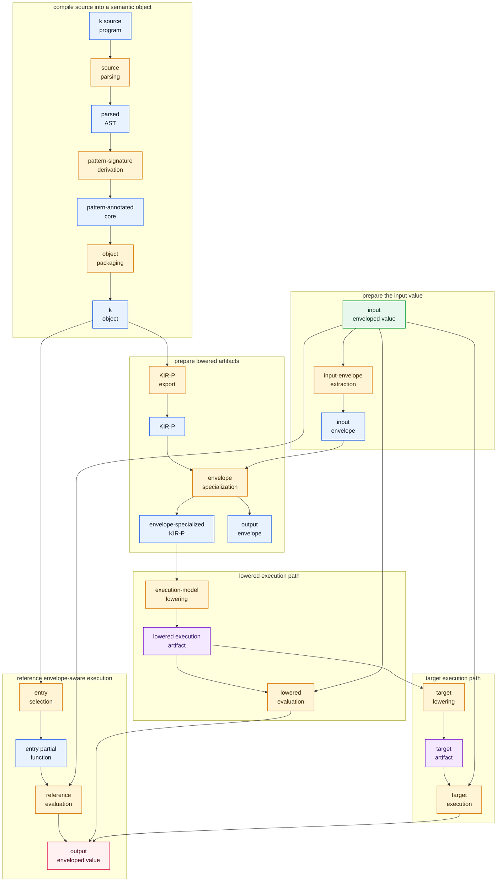
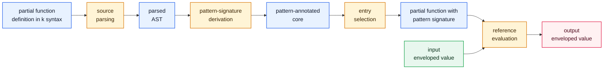
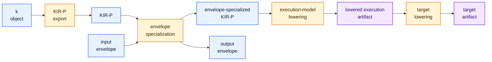

# Concept Dictionary

This document defines the main concepts, artifacts, values, and transformations
of the k system. It is written as a standalone specification: terms are defined
by their role in the language and compilation pipeline, not by any particular
concrete compiler, storage encoding, or tool interface.

The goal is to keep one vocabulary across source semantics, object artifacts,
intermediate representations, value serialization, reference execution, and
target execution.

## Naming Principles

- Use semantic names for all externally visible concepts.
- Distinguish a concept from its serialized representation.
- Distinguish source syntax from the semantic object represented by that syntax.
- Distinguish a mathematical function from the compiler artifacts used to
  compile or execute it.
- Treat "pattern" as a type-context concept, not as ordinary value-pattern
  matching over raw trees.

## Source-Level Concepts

### k Source

`k source` is the textual language read by the parser. It can define types,
partial functions, and an entry expression.

Use this term for source text before compiler passes have resolved names,
canonicalized types, or derived pattern information.

### Expression

An `expression` is a source-level program fragment that denotes a partial
function over enveloped values.

Expressions include identity, composition, projection, variant introduction,
product construction, ordered union, type checks, pattern guards, and references
to named partial functions or intrinsics.

### Partial Function

A partial function maps an input enveloped value to an output enveloped value
when it is defined. If it is not defined for the input, execution fails normally.
This failure is part of the language semantics, not a system exception.

Mathematically, a k program denotes a deterministic partial function.

### Type

A `type` describes a set of value trees accepted by an algebraic shape. Types are
built from products and tagged unions.

Use "type" for the semantic concept. Avoid using "code" by itself in public docs
when the meaning is type.

### Type Code

A `type code` is the canonical, hashable representation of a type.

Use "type" for the semantic concept and "type code" for its canonical
representation.

### Pattern Guard

A `pattern guard` is an expression that constrains the input envelope to a type
pattern and otherwise behaves like identity.

Source syntax may present this operation as a filter expression. The semantic
operation is a pattern guard.

## Values, Types, And Patterns

### Value Tree

A `value tree` is the product/variant tree part of a value during execution.

By itself, a value tree is not enough to recover the semantic value at a binary
or polymorphic boundary. The same tree can be meaningful under different type
contexts.

### Type Pattern

A `type pattern` describes a set of possible types. It is the semantic object
represented by source filter syntax and by the pattern graphs carried through
compilation and execution.

The short name `pattern` is acceptable once the context is clear. Use "type
pattern" when introducing the concept or when there is risk of confusion with
ordinary value matching.

Examples of type pattern kinds include:

- any type;
- open product;
- closed product;
- open union;
- closed union;
- singleton type pattern derived from a concrete type code.

### Pattern Graph

A `pattern graph` is the graph representation of a type pattern. Nodes describe
pattern kind and openness. Edges describe required product fields or union tags.

Pattern graph node identity matters: if two positions point to the same pattern
node, they must share the same type context.

Use "pattern graph" for the representation, and "type pattern" for the semantic
constraint it represents.

### Envelope

An `envelope` is the type pattern carried with a value at an execution or wire
boundary.

The envelope describes the type context in which the value tree should be
decoded, checked, projected, transformed, or encoded. The spelling should always
be `envelope`.

### Enveloped Value

An `enveloped value` is a pair:

```text
(value tree, envelope)
```

Structural operations propagate or refine the envelope:

- projection selects a subpattern;
- product construction builds a closed product envelope from field envelopes;
- variant introduction builds an open union envelope for the introduced tag;
- pattern guards intersect the active envelope with a static type pattern.

The envelope is part of the semantic value at compilation and execution
boundaries. A value tree without an envelope is incomplete at those boundaries.

### Pattern Signature

A `pattern signature` is the input/output type-pattern pair attached to an
expression or partial function:

```text
input pattern -> output pattern
```

Pattern signatures are compiler facts. They constrain valid inputs and describe
the envelope shape produced when evaluation succeeds.

### Domain

Use "domain" carefully.

The input pattern of a partial function is a static type-context constraint, not
necessarily the exact mathematical domain of the function. A function may still
be undefined for some enveloped values that fit its input pattern.

Prefer:

- "input pattern";
- "accepted envelope";
- "static input constraint".

Use "domain" only when referring to the actual set of inputs for which the
partial function is defined.

## Serialization And Boundaries

### Wire Stream

A `wire stream` is the binary transport representation of an enveloped value.

The active format is:

```text
encoded envelope, followed by value bits encoded under that envelope
```

Use "wire stream" or "pattern+value wire stream" for external transport
boundaries. Use "enveloped value" for the semantic object used during
execution.

### Codec

A `codec` converts between an external representation and a k wire stream.

Examples include the unit, JSON, integer, IEEE, UTF-8, and UTF-16 codecs. A
codec must preserve the envelope/value relationship: it either supplies an
envelope for parsing, decodes the envelope from the stream for printing, or
works with a universal representation that can infer a suitable envelope.

### Input Envelope

An `input envelope` is the pattern carried by the input value at a program or
execution boundary.

Execution targets use the input envelope to specialize or validate execution.
The input envelope can be provided explicitly, derived from a type expression, or
decoded from a wire stream.

### Output Envelope

An `output envelope` is the pattern attached to the output value after execution.

A correct runner must emit both the output envelope and the output value bits.
Rendered values can hide envelope differences, so conformance checks must compare
envelopes whenever envelope identity matters.

## Compiler Stages

### Parsed AST

The `parsed AST` is the direct parser output. It keeps source-shaped expression
nodes, source names, source ranges, and filter syntax.

Use this term only for the representation before type-code registration,
partial-function canonicalization, and pattern derivation.

### Pattern-Annotated Core

`Pattern-annotated core` is the first semantic compiler artifact after parsing.

It keeps the expression structure close to k source, but it has:

- registered canonical type codes;
- resolved type references to canonical type-code names;
- partial-function dependency information;
- canonical aliases for partial functions;
- a type-pattern graph for each partial function;
- a pattern signature on each expression;
- type-derivation convergence status.

The key product is still a k-shaped core expression graph, now annotated by
type-pattern facts. This stage is a semantic artifact; it does not imply a
particular serialized format.

### k Object

A `k object` is a compiled semantic object.

It stores canonical type codes, partial functions, aliases, metadata,
type-pattern graphs, and type-derivation status.

An executable object has a main partial function. A library object contains
reusable definitions but no selected main partial function.

### KIR-P

`KIR-P` is the portable, polymorphic K Intermediate Representation.

It is a stable artifact contract over k objects. It preserves pattern-carrying
semantics while normalizing names, expression opcodes, and pattern graph node IDs
so consumers do not depend on parser-shaped fields or object encoding details.

Use KIR-P as the shared semantic contract between k objects and lower-level
execution artifacts.

### Envelope-Specialized KIR-P

`Envelope-specialized KIR-P` is KIR-P rebuilt for a concrete input envelope.

Envelope-specialization:

- takes a KIR-P object or k object;
- takes an input envelope;
- re-runs pattern derivation as if the entry expression were guarded by that
  envelope;
- derives the corresponding output envelope;
- emits ordinary KIR-P for the specialized entry partial function.

### KIR-M

`KIR-M` is a materialized execution layer after envelope-specialized KIR-P.

It should contain layout and ABI decisions such as field offsets, tag dispatch,
call-site specialization, and envelope-free execution assumptions.

### Lowered Execution Model

A `lowered execution model` is an executable middle layer.

It lowers KIR-P partial-function bodies into a small instruction model with
explicit partial failure, pattern guards, projections, construction, calls, and
returns.
It is an execution contract that a lower-level compiler or executor can
consume. It is not defined by a particular byte encoding.

`kVM` is the name used in this specification for such a lowered execution model.

### Lowered Execution Artifact

A `lowered execution artifact` is a post-envelope-specialization execution
artifact.

It is produced by taking a source or object program, specializing it against a
concrete input envelope, lowering the resulting KIR-P to a lowered execution
model, and wrapping the entry metadata and functions. It is not the same thing
as a general k object.

## Execution Concepts

### Envelope-Aware Execution

`Envelope-aware execution` carries envelopes through inner operations.

This mode matches the reference execution and codec model. It is the safest
semantic baseline because values keep their envelope throughout execution.

### Envelope-Free Execution

`Envelope-free execution` uses static layout and pattern information inside the
compiled function and attaches the derived output envelope only at the boundary.

This is valid only when envelope-specialization and type derivation prove the
needed pattern contexts.

### Partial Failure

`Partial failure` is the normal result when a partial function is undefined for
its input.

In high-level execution this is represented as absence of an output value. In
lower-level execution contracts it may be represented explicitly as a failed
result. It is distinct from malformed artifacts, system failures, and host
exceptions.

### Intrinsic

An `intrinsic` is a predefined operation supplied by the execution environment and
known to the compiler.

Intrinsics need explicit type and lowering rules. Pure identity-like intrinsics
can participate in ordinary partial-function semantics. Effectful or host-only
intrinsics require explicit ordering constraints or must be excluded from pure
lowering targets.

## Transformation Graphs

This section names the transformations between the concepts above.

The diagrams use a Petri-net-like convention:

- all nodes are rectangles;
- blue nodes are artifacts or semantic concepts;
- amber nodes are transformations;
- green nodes are execution values or wire streams;
- purple nodes are lowered execution artifacts;
- every transformation is shown as an explicit node between its inputs and
  outputs;
- a transformation with several incoming arrows needs all shown inputs.

### Whole-System Artifact Graph

This graph starts with a partial function definition in k syntax and an input
enveloped value. It ends with an output enveloped value. Lowering paths branch
after the k object.



### Reference Execution Graph

The reference path is the semantic baseline. It can run directly from source or
from a loaded k object. It stays envelope-aware: the value keeps its envelope
through projections, constructors, pattern guards, and partial-function calls.



### Lowering Preparation Graph

The lowering preparation path starts from a k object and an input envelope. It
specializes the program for that envelope, derives the output envelope, lowers
to a lowered execution artifact, and may then lower to a concrete execution
target.



### Wire Boundary Graph

The wire boundary is separate from program compilation. It converts between a
binary pattern+value stream and the in-memory enveloped value that execution
uses.

```mermaid
%%{init: {"flowchart": {"htmlLabels": true, "nodeSpacing": 42, "rankSpacing": 50}, "themeVariables": {"fontSize": "18px"}} }%%
flowchart LR
  classDef transform fill:#fff4d6,stroke:#d97706,stroke-width:1.5px,color:#3b2300;
  classDef value fill:#e8f7ee,stroke:#16a34a,stroke-width:1.5px,color:#052e16;
  classDef result fill:#fff1f2,stroke:#e11d48,stroke-width:1.5px,color:#4c0519;

  InputWire["input wire<br/>stream"]:::value
  Decode["wire<br/>decoding"]:::transform
  InputValue["input<br/>enveloped value"]:::value
  Execute["reference/target<br/>execution"]:::transform
  OutputValue["output<br/>enveloped value"]:::result
  Encode["wire<br/>encoding"]:::transform
  OutputWire["output wire<br/>stream"]:::result

  InputWire --> Decode --> InputValue
  InputValue --> Execute --> OutputValue
  OutputValue --> Encode --> OutputWire
```



### Transformation Naming Scheme

Use noun phrases ending in the operation kind:

- `Parsing` for syntax to AST.
- `Registration` for assigning canonical identities.
- `Construction` for building semantic tables from parsed material.
- `Derivation` for computing type-pattern information.
- `Canonicalization` for stable names and hashes.
- `Packaging` for serializable artifacts.
- `Loading` for reconstructing semantic objects from artifacts.
- `Selection` for choosing an entry object from a larger artifact.
- `Evaluation` for executing a semantic or lowered execution artifact.
- `Extraction` for reading a component from an artifact without changing it.
- `Export` for a stable inspection or interchange view.
- `Specialization` for rewriting an artifact for a concrete envelope.
- `Lowering` for moving to a lower-level execution contract.
- `Encoding` and `Decoding` for wire boundaries.
- `Rendering` for human or external presentation.

Use lowercase hyphenated identifiers for transformation contracts. These
identifiers name abstract transformation boundaries, not concrete function
names.

### Transformation Contract Summary

| Identifier | Preferred name | Inputs | Outputs |
| --- | --- | --- | --- |
| `source-parsing` | Source Parsing | k source program | parsed AST |
| `type-code-registration` | Type-Code Registration | parsed AST | canonical type-code table |
| `partial-function-table-construction` | Partial-Function Table Construction | parsed AST, canonical type-code table | source partial-function table |
| `pattern-signature-derivation` | Pattern-Signature Derivation | source partial-function table, canonical type-code table | pattern-annotated core |
| `partial-function-canonicalization` | Partial-Function Canonicalization | pattern-annotated core | canonical partial-function aliases |
| `object-packaging` | Object Packaging | pattern-annotated core, canonical partial-function aliases | k object |
| `object-loading` | Object Loading | k object | loaded k object |
| `entry-selection` | Entry Selection | pattern-annotated core or loaded k object | entry partial function |
| `reference-evaluation` | Reference Evaluation | entry partial function, input enveloped value | output enveloped value or partial failure |
| `input-envelope-extraction` | Input-Envelope Extraction | input enveloped value | input envelope |
| `kir-p-export` | KIR-P Export | k object | KIR-P |
| `envelope-specialization` | Envelope Specialization | KIR-P or k object, input envelope | envelope-specialized KIR-P, output envelope |
| `execution-model-lowering` | Execution-Model Lowering | envelope-specialized KIR-P | lowered execution artifact |
| `lowered-evaluation` | Lowered Evaluation | lowered execution artifact, input enveloped value | output enveloped value or partial failure |
| `target-lowering` | Target Lowering | lowered execution artifact | target artifact |
| `target-execution` | Target Execution | target artifact, input enveloped value or input wire stream | output enveloped value or output wire stream |
| `wire-decoding` | Wire Decoding | input wire stream | input enveloped value |
| `wire-encoding` | Wire Encoding | output enveloped value | output wire stream |
| `external-rendering` | External Rendering | output wire stream or output enveloped value | external text, JSON, or host value |

### Abstract Transformation Contracts

Each transformation should be implementable and testable as an independent
contract. A concrete compiler may combine several transformations for
performance or convenience, but tests should still be able to isolate these
boundaries.

#### Source Parsing (`source-parsing`)

Inputs:

- k source program.

Outputs:

- parsed AST.

Contract:

- Parse textual k syntax into source-shaped AST nodes.
- Preserve source names, source ranges, and source-level filter syntax.
- Do not resolve type names, derive patterns, or assign canonical hashes.
- Reject malformed syntax with a diagnostic tied to the source location when
  available.

Independent tests:

- Minimal expression parses to the expected AST shape.
- Type definitions and partial-function definitions remain distinct.
- Source ranges survive for expressions and nested filters.
- Invalid syntax fails before any later compiler transformation runs.

#### Type-Code Registration (`type-code-registration`)

Inputs:

- parsed AST.

Outputs:

- canonical type-code table.
- source-name to type-code alias map.

Contract:

- Convert source type definitions into canonical type-code identities.
- Resolve structural type definitions into stable hashable representations.
- Preserve enough alias information to report source names in diagnostics and
  metadata.
- Do not derive partial-function pattern signatures or execute partial-function
  bodies.

Independent tests:

- Structurally equivalent type definitions produce the same canonical type code.
- Distinct product/union structures produce distinct type codes.
- Recursive type definitions produce stable identities.
- Undefined type references fail at this boundary, not during later lowering.

#### Partial-Function Table Construction (`partial-function-table-construction`)

Inputs:

- parsed AST.
- canonical type-code table.

Outputs:

- source partial-function table.

Contract:

- Collect named partial-function definitions and the entry expression.
- Rewrite type references in expressions to canonical type-code names where the
  source syntax explicitly names a type.
- Preserve source partial-function names before canonicalization.
- Preserve expression structure; do not add inferred boundary guards or lowering
  instructions.

Independent tests:

- Named definitions and the entry expression are both present.
- References to known source types resolve through the type-code table.
- References to unknown partial functions remain diagnosable.
- Expression ordering in composition and ordered union is preserved.

#### Pattern-Signature Derivation (`pattern-signature-derivation`)

Inputs:

- source partial-function table.
- canonical type-code table.

Outputs:

- pattern-annotated core.

Contract:

- Build one type-pattern graph for each partial function.
- Attach a pattern signature to each expression node.
- Convert source filter syntax into type-pattern graph nodes.
- Propagate constraints through composition, projection, product construction,
  ordered union, references, and type-code expressions.
- Record type-derivation convergence status.

Independent tests:

- Identity has the same input and output pattern representative.
- Composition unifies each stage output with the next stage input.
- Product construction derives a closed product output pattern.
- Projection derives an open product or open union input pattern as appropriate.
- Pattern guards constrain input and output to the same pattern.
- Recursive partial functions report converged or not-converged status
  deterministically.

#### Partial-Function Canonicalization (`partial-function-canonicalization`)

Inputs:

- pattern-annotated core.

Outputs:

- canonical partial-function aliases.
- updated canonical references.

Contract:

- Compute stable canonical representations for partial functions.
- Assign canonical hash aliases after dependency and convergence analysis.
- Keep source aliases for diagnostics, metadata, and decompilation.
- Preserve semantics: canonicalization must not change evaluation results.

Independent tests:

- Whitespace and source alias changes do not change canonical aliases.
- Semantically different bodies produce different canonical aliases.
- Mutually recursive groups canonicalize deterministically.
- References inside canonicalized definitions point at the intended canonical
  partial functions.

#### Object Packaging (`object-packaging`)

Inputs:

- pattern-annotated core.
- canonical partial-function aliases.

Outputs:

- k object.

Contract:

- Produce a k object artifact from the compiled semantic object.
- Preserve canonical type codes, partial functions, aliases, metadata,
  type-pattern graphs, and type-derivation status.
- For executable objects, preserve the entry partial function.
- For library objects, preserve exported reusable definitions without an entry.
- Do not require an input enveloped value.

Independent tests:

- Packaged executable objects retain a main entry.
- Packaged libraries have no main entry.
- Object round trips preserve type-pattern graph structure and aliases.
- Unreachable semantic material is either intentionally pruned or intentionally
  preserved according to the object contract.

#### Object Loading (`object-loading`)

Inputs:

- k object.

Outputs:

- loaded k object.

Contract:

- Reconstruct a usable semantic object from a k object artifact.
- Preserve the artifact's semantic content exactly.
- Make the object usable by reference evaluation, KIR-P export, and lowering
  preparation.
- Do not re-run source parsing or type derivation.

Independent tests:

- Loading followed by packaging is semantically stable.
- Pattern graph representatives are usable after loading.
- Loaded objects evaluate the same as freshly compiled objects.
- Malformed object artifacts fail at loading.

#### Entry Selection (`entry-selection`)

Inputs:

- pattern-annotated core or loaded k object.
- optional requested partial-function name.

Outputs:

- entry partial function.

Contract:

- Resolve the entry partial function to execute or specialize.
- Default to the executable object's main partial function when no explicit name is
  provided.
- Resolve source aliases to canonical names where needed.
- Fail if the requested entry cannot be found or if no entry exists.

Independent tests:

- Executable objects select their main partial function by default.
- Explicit source aliases resolve to the intended canonical partial function.
- Library objects require an explicit exported partial function.
- Missing entries produce targeted diagnostics.

#### Reference Evaluation (`reference-evaluation`)

Inputs:

- entry partial function.
- input enveloped value.

Outputs:

- output enveloped value, or partial failure.

Contract:

- Execute the envelope-aware reference semantics.
- Intersect input envelopes with static input patterns.
- Propagate subpatterns through projections.
- Build output envelopes for product and variant construction.
- Return partial failure when the partial function is undefined for the input.
- Throw diagnostics only for malformed artifacts or type-envelope contradictions.

Independent tests:

- Identity returns the same enveloped value.
- Projection returns the correct child with the correct sub-envelope.
- Product construction builds the expected output tree and envelope.
- Ordered union tries later branches only after earlier partial failure.
- Pattern guard failure is reported as undefinedness or a type-envelope error
  according to the reference semantics.

#### Input-Envelope Extraction (`input-envelope-extraction`)

Inputs:

- input enveloped value.

Outputs:

- input envelope.

Contract:

- Read the envelope carried by the input value.
- Do not inspect or transform the value tree except as needed to validate that
  the envelope exists and is well formed.
- Preserve the envelope representation expected by specialization and lowering
  transformations.

Independent tests:

- Extraction returns the exact pattern attached to the input value.
- Missing envelopes fail when the caller requires specialization.
- Malformed pattern graphs are rejected before lowering preparation.

#### KIR-P Export (`kir-p-export`)

Inputs:

- k object.

Outputs:

- KIR-P.

Contract:

- Produce the portable polymorphic view of a k object.
- Normalize expression op names into the KIR-P vocabulary.
- Convert per-partial-function pattern graphs to dense local node IDs.
- Preserve type codes, aliases, metadata, and type-derivation status needed by
  consumers.
- Do not specialize for any input envelope.
- Do not make consumers depend on any particular object encoding.

Independent tests:

- Export is deterministic for the same object.
- Pattern graph IDs are dense and local to each partial function.
- KIR-P expression opcodes are from the closed KIR-P vocabulary.
- KIR-P export preserves enough information for reference/lowered conformance
  tests.

#### Envelope Specialization (`envelope-specialization`)

Inputs:

- KIR-P or k object.
- input envelope.
- optional entry partial-function name.

Outputs:

- envelope-specialized KIR-P.
- output envelope.

Contract:

- Specialize the entry partial function as if guarded by the input envelope.
- Re-run pattern-signature derivation for the specialized entry context.
- Preserve ordinary KIR-P shape in the emitted artifact.
- Derive the output envelope for that invocation.
- Keep call-site worklists, cache keys, and instance metadata internal unless a
  later artifact contract explicitly exposes them.

Independent tests:

- Specialization of `P f` matches compiling an entry expression guarded by `P`.
- Output envelope matches reference execution for representative inputs.
- The emitted artifact remains ordinary KIR-P, not a separate wrapper format.
- A helper used under two input envelopes can specialize differently without
  corrupting the unspecialized object.

#### Execution-Model Lowering (`execution-model-lowering`)

Inputs:

- envelope-specialized KIR-P.

Outputs:

- lowered execution artifact.

Contract:

- Lower KIR-P partial-function bodies to an explicit execution model.
- Preserve input and output pattern metadata on the entry function.
- Represent partial failure explicitly.
- Lower pattern guards, type checks, projections, constructors, calls, ordered
  unions, and sequencing according to the lowered execution semantics.
- Enforce artifact eligibility rules such as accepted input-envelope shape at
  the packaging boundary.

Independent tests:

- Identity lowers to a return of the input.
- Pattern guards lower to guard instructions or proven redundant checks.
- Product and variant operations preserve field/tag semantics.
- Ordered union preserves branch order and rollback/failure behavior.
- Non-eligible input envelopes are rejected with a targeted diagnostic when a
  lowered artifact requires a narrower envelope.

#### Lowered Evaluation (`lowered-evaluation`)

Inputs:

- lowered execution artifact.
- input enveloped value.

Outputs:

- output enveloped value, or partial failure.

Contract:

- Execute the lowered execution model.
- Validate the input envelope against the artifact input pattern.
- Return output values under the artifact output pattern.
- Preserve partial failure as an ordinary execution result.
- Match reference evaluation for the specialized artifact.

Independent tests:

- Lowered evaluation matches reference evaluation on conformance fixtures.
- Input envelope mismatch fails before producing output.
- Recursive or repeated calls preserve deterministic results.
- Partial failure matches reference undefinedness.

#### Target Lowering (`target-lowering`)

Inputs:

- lowered execution artifact.

Outputs:

- target artifact.

Contract:

- Lower the lowered execution artifact to a concrete execution target.
- Preserve the input and output envelope contract at the target boundary.
- Emit explicit success/failure result status.
- Reject unsupported operations with diagnostics rather than silently changing
  semantics.

Independent tests:

- Generated target artifact has the expected entry shape.
- Supported lowered operations lower without fallback to unrelated generic paths.
- Unsupported operations fail predictably.
- Target output matches reference output for supported fixtures.

#### Target Execution (`target-execution`)

Inputs:

- target artifact.
- input enveloped value or input wire stream.

Outputs:

- output enveloped value or output wire stream.

Contract:

- Run the target artifact for a specialized partial function.
- Validate or decode the input envelope at the boundary.
- Emit the compiled output envelope with the output value.
- Preserve partial failure according to the target execution contract.

Independent tests:

- Target execution matches reference output on supported fixtures.
- Wire output includes the expected output envelope.
- Persistent and one-shot runners produce the same results.
- Partial failure is distinguishable from process or system failure.

#### Wire Decoding (`wire-decoding`)

Inputs:

- input wire stream.

Outputs:

- input enveloped value.

Contract:

- Decode the leading envelope representation.
- Decode the following value bits under that envelope.
- Attach the decoded envelope to the execution value.
- Reject malformed streams, invalid envelopes, and non-zero padding according to
  the wire format.

Independent tests:

- Encoding followed by decoding returns the same enveloped value.
- Decoding rejects truncated streams.
- Decoding rejects value bits that are impossible under the decoded envelope.
- The decoded value carries the decoded envelope, not a recomputed substitute.

#### Wire Encoding (`wire-encoding`)

Inputs:

- output enveloped value.
- optional explicit output envelope.

Outputs:

- output wire stream.

Contract:

- Choose the explicit envelope when supplied, otherwise use the value envelope.
- Validate or coerce the value against the chosen envelope according to the codec
  contract.
- Write the encoded envelope followed by the value bits encoded under it.
- Produce deterministic bytes for the same value and envelope.

Independent tests:

- Decoding the encoded stream returns the original enveloped value.
- Explicit envelopes override carried envelopes only when compatible.
- Incompatible explicit envelopes fail before bytes are emitted.
- Equivalent values under equivalent envelopes produce stable byte streams.

#### External Rendering (`external-rendering`)

Inputs:

- output wire stream or output enveloped value.

Outputs:

- external text, JSON, or host value.

Contract:

- Render values for humans or external systems.
- Preserve envelope visibility when debug or inspection mode requests it.
- Avoid presenting rendered tree equality as proof of envelope equality.
- Do not feed rendered output back into target parity tests unless the envelope
  is also checked.

Independent tests:

- Rendering a known enveloped value produces expected text/JSON.
- Debug rendering includes the envelope.
- Two values with the same tree and different envelopes can be distinguished in
  inspection mode.
- Rendering errors do not imply execution errors.

### Transformation Notes

- Compilation transformations do not need an input value until
  envelope-specialization or execution.
- Reference execution can use the pattern-annotated core directly; target
  execution goes through KIR-P and a lowered execution artifact.
- Envelope-specialization is not a new source language feature. It is a compiler
  transformation driven by the input envelope.
- The output envelope is an artifact of execution or specialization. It must be
  preserved at binary boundaries even when printed value trees look identical.
- Partial failure is an ordinary result of execution transformations. It should
  not be modeled as a malformed artifact.

## Recommended Pipeline Vocabulary

Use this pipeline in high-level docs:

```text
k source
  -> parsed AST
  -> pattern-annotated core
  -> k object
  -> KIR-P
  -> envelope-specialized KIR-P
  -> lowered execution artifact
  -> target artifact
```

For the execution and codec boundary:

```text
wire stream <-> enveloped value <-> partial function <-> enveloped value <-> wire stream
```

## Terminology Rules

These rules are normative for this specification:

- Use "partial function" as the dominant public term. Avoid "partial
  transform"; it can read as unfinished rather than undefined for some inputs.
- Keep "pattern-annotated core" as the name for the normalized,
  anonymized, pattern-annotated AST stage.
- Use "envelope-specialized KIR-P" for KIR-P rebuilt under a concrete input
  envelope.
- Use "type code" for the canonical representation of a type, and "type" for
  the semantic concept.
- Use "envelope" for the type pattern carried with a value at an execution or
  wire boundary.
- Use "pattern guard" for the semantic operation that constrains an envelope;
  reserve "filter expression" for source syntax when the syntax itself is being
  discussed.
