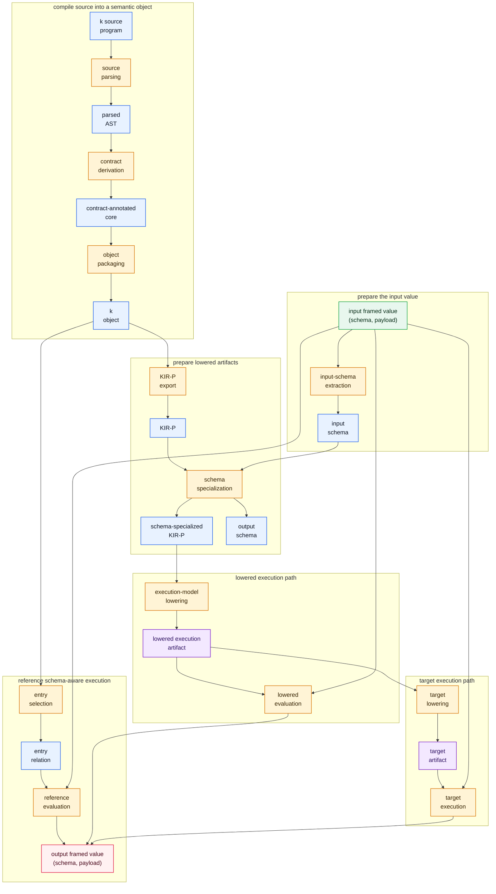
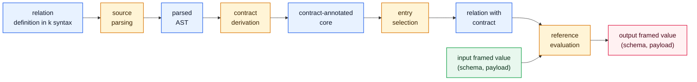
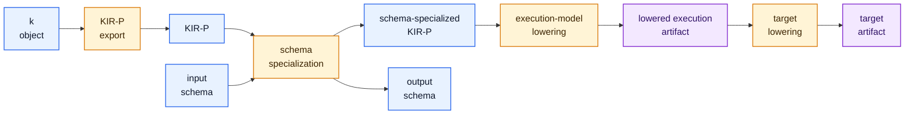

# Concept Dictionary

This document defines the main concepts, artifacts, values, and transformations
of the k system. It is written as a standalone specification: terms are defined
by their role in the language and compilation pipeline, not by any particular
concrete compiler, storage encoding, or tool interface.

The goal is to keep one vocabulary across source semantics, object artifacts,
intermediate representations, value serialization, reference execution, and
target execution.

## Naming Principles

- Use semantic names for all externally visible concepts.
- Distinguish a concept from its serialized representation.
- Distinguish source syntax from the semantic object represented by that syntax.
- Distinguish a mathematical relation from the compiler artifacts used to
  compile or execute it.
- Use `schema` for data shapes (algebraic tree automata), `contract` for
  relational signatures, `filter` for partial identity guards and inductive
  witnesses, and `(schema, payload)` for framed runtime values.

## Source-Level Concepts

### k Source

`k source` is the textual language read by the parser. It defines relations
(including schemas defined as partial identities/filters) and an optional
entry expression.

Use this term for source text before compiler passes have resolved names,
canonicalized schemas, or derived relational contracts.

### Expression

An `expression` is a source-level program fragment that denotes a partial
relation over framed values.

Expressions include identity, composition, projection, variant introduction,
product construction, ordered union, filters, and references to named
relations or intrinsics.

### Partial Relation

A `partial relation` maps an input framed payload to an output framed payload
when it is defined. If it is not defined for the input, execution fails normally.
This failure is part of the language semantics, not a system exception.

Mathematically, a k program denotes a deterministic partial relation
(partial function).

### Schema

A `schema` describes a set of labeled tree payloads accepted by a finite tree
automaton. Schemas are built from products and tagged unions. A schema can be
*closed* (all constructors determined) or *open* (containing schema parameters
$X, Y$).

Use "schema" for the semantic concept. Avoid using "code" or "type pattern" by
itself in public docs when the meaning is a schema.

### Canonical Schema

A `canonical schema` is the deterministic, hashable normal form of a schema
automaton. Its canonical textual syntax is its primary universal identity in the
schema registry; its `@hash` is a fixed-width indexing digest.

### Filter

A `filter` is an expression `?schema` that constrains the input payload to a
schema and otherwise behaves like identity.

In recursive relations, filters also serve as **inductive termination witnesses**,
ensuring contract derivation converges.

### Canonical Content-Addressed Hash (`@hash`)

A `canonical content-addressed hash` is the immutable, unique identifier
derived from the normalized AST of a relation or the minimal deterministic
tree automaton of a schema.

In `k`, there is no global symbol namespace. Every compiled relation and
schema is identified globally and uniquely by its `@hash`.

### Local Alias

A `local alias` is a human-readable identifier (such as `plus`, `int`,
or `5`) mapped to a canonical hash in object metadata (`relAlias`,
`schemaAliases`).

Aliases are local to their compilation scope. When loading libraries
with `--lib`, canonical definitions are available by their `@hash`, but
local aliases are not automatically exported into the consumer's scope
unless explicitly mapped with `--export`.

### Relations as Values (No Built-in Numbers)

In `k`, there are no primitive numerical types or built-in integer
literals. Numerical identifiers such as `5` or `10` are nullary
relations (constants) mapping the unit `{}` to bit trees of contract
`{} -> bits`. Operations on signed integers (`int`) require
converting bit trees via the `int` constructor (`5 int`).

## Values, Schemas, And Contracts

### Payload Tree (or Payload)

A `payload tree` (or `payload`) is the product/variant tree part of a value during
execution.

By itself, a raw payload tree is not self-describing at a binary or polymorphic
boundary. The same tree is meaningful only when framed by a schema.

### Schema

A `schema` describes a set of possible payload trees accepted by an algebraic
automaton. It is the semantic object represented by source filter syntax and by the
schema graphs carried through compilation and execution.

Examples of schema kinds include:

- unconstrained schema parameter (`X`, `?X`);
- open product;
- closed product;
- open union;
- closed union;
- closed schema derived from concrete definitions.

### Schema Graph

A `schema graph` is the graph representation of a schema. Nodes describe
schema kind and openness. Edges describe required product fields or union tags.

Schema graph node identity matters: if two positions point to the same schema
node, they share the exact same schema structure.

Use "schema graph" for the representation, and "schema" for the semantic
language it defines.

### Framed Value `(schema, payload)`

A `framed value` (formerly called an enveloped value) is a pair:

```text
(schema, payload)
```

Structural operations propagate or refine the framing schema:

- projection selects a subschema;
- product construction builds a closed product schema from field schemas;
- variant introduction builds an open union schema for the introduced tag;
- filters intersect the active schema with a static schema constraint.

The schema is part of the semantic value at compilation and execution
boundaries. A payload tree without a framing schema is incomplete at those boundaries.

### Contract

A `contract` is the derived $(input, output)$ linked schema graph attached to an
expression or relation:

```text
input schema -> output schema
```

Contracts are compiler facts. Unlike independent types, a contract is a single
connected schema graph where shared vertices ($=X$) prove structure preservation:
input substructures flow through to the output without destruction or rebuilding.
Contracts guide diagnostics, REPL output, binary serialization, and optimizations.

### Domain

Use "domain" carefully.

The input schema of a relation is a static constraint, not
necessarily the exact mathematical domain of the relation. A relation may still
be undefined for some payload trees that fit its input schema.

Prefer:

- "input schema";
- "accepted schema";
- "static input constraint".

Use "domain" only when referring to the actual set of inputs for which the
partial relation is defined.

## Serialization And Boundaries

### Wire Stream

A `wire stream` is the binary transport representation of a framed value `(schema, payload)`.

The active format is:

```text
encoded schema, followed by payload bits encoded under that schema
```

Use "wire stream" or "schema+payload wire stream" for external transport
boundaries. Use "framed value" for the semantic object used during
execution.

### Codec

A `codec` converts between an external representation and a k wire stream.

Examples include the unit, JSON, integer, IEEE, UTF-8, and UTF-16 codecs. A
codec must preserve the schema/payload relationship: it either supplies a
schema for parsing, decodes the schema from the stream for printing, or
works with a universal representation that can infer a suitable schema.

### Input Schema

An `input schema` is the schema framing the input payload at a program or
execution boundary.

Execution targets use the input schema to specialize or validate execution.
The input schema can be provided explicitly, derived from a filter expression, or
decoded from a wire stream.

### Output Schema

An `output schema` is the schema attached to the output payload after execution.

A correct runner must emit both the output schema and the output payload bits.
Rendered values can hide schema differences, so conformance checks must compare
schemas whenever schema identity matters.

## Compiler Stages

### Parsed AST

The `parsed AST` is the direct parser output. It keeps source-shaped expression
nodes, source names, source ranges, and filter syntax.

Use this term only for the representation before schema registration,
relation canonicalization, and contract derivation.

### Contract-Annotated Core

`Contract-annotated core` is the first semantic compiler artifact after parsing.

It keeps the expression structure close to k source, but it has:

- registered canonical schemas;
- resolved schema references to canonical schema names;
- relation dependency information;
- canonical aliases for relations;
- a schema graph for each relation;
- a contract on each expression;
- contract-derivation convergence status.

The key product is still a k-shaped core expression graph, now annotated by
schema contract facts. This stage is a semantic artifact; it does not imply a
particular serialized format.

### Ahead-Of-Time (AOT) Contract Checking

`Ahead-of-time (AOT) contract checking` refers to the compilation phase
where parsing, relation expansion, structural contract derivation, and
fixed-point constraint convergence are solved in advance.

The resulting compiled artifacts (`.ko`, `.klib`, `.kvm`) store fully
derived principal schema contracts and interned schemas, allowing downstream
execution or linking to skip cold-start derivation entirely.

### k Object

A `k object` is a compiled semantic object.

It stores canonical schemas, relations, aliases, metadata,
schema graphs, and contract-derivation status.

An executable object (`.ko`) has an execution entrypoint (`main:
"__main__"`). A library object (`.klib`) contains reusable definitions
but no selected main relation (`main: null`).

### File Formats in the K Universe

The `k` toolchain defines four primary file formats (for comprehensive
details and workflows, see [`DOCS/FILE_FORMATS.md`](FILE_FORMATS.md)):

- **Source File (`.k`):** Plain UTF-8 source text defining algebraic
  schemas, relations, and expressions.
- **Executable Object (`.ko`):** AOT contract-checked executable artifact
  with binary header `KOBJ\n` and JSON payload containing schemas, relations,
  and entrypoint `main: "__main__"`. Executable directly via `k.mjs`,
  WebAssembly, or LLVM.
- **Library Object (`.klib`):** AOT contract-checked library container stored
  as plain UTF-8 JSON without an entrypoint (`main: null`). Provides
  reusable pre-converged relations and schema graphs for downstream linking.
- **Polymorphic kVM Template (`.kvm`):** Register-IR bytecode template
  (`format: "k-vm"`, `layer: "KVM-P"`) carrying principal contracts.
  Specialized on-the-fly at runtime (`specializeKVM`) against concrete
  input schemas $(v, S_v)$ without re-running type inference.

### Stream Transformer vs. Closed Constant Relation

- A **stream transformer** is a relation with an open input schema (e.g. `{() x,
  5 int y} plus`) that consumes external data arriving from a binary
  stream or standard input.
- A **closed constant relation** is a relation with no free inputs (such
  as `{10 int x, 5 int y} plus`). Its input schema is the unit `{}`,
  requiring an empty unit `{}` when executed as a standalone script.

### KIR-P

`KIR-P` is the portable, polymorphic K Intermediate Representation.

It is a stable artifact contract over k objects. It preserves schema-carrying
semantics while normalizing names, expression opcodes, and schema graph node IDs
so consumers do not depend on parser-shaped fields or object encoding details.

Use KIR-P as the shared semantic contract between k objects and lower-level
execution artifacts.

### Schema-Specialized KIR-P

`Schema-specialized KIR-P` is KIR-P rebuilt for a concrete input schema.

Schema-specialization:

- takes a KIR-P object or k object;
- takes an input schema;
- re-runs contract derivation as if the entry expression were filtered by that
  schema;
- derives the corresponding output schema;
- emits ordinary KIR-P for the specialized entry relation.

### KIR-M

`KIR-M` is a materialized execution layer after schema-specialized KIR-P.

It should contain layout and ABI decisions such as field offsets, tag dispatch,
call-site specialization, and schema-free execution assumptions.

### Lowered Execution Model

A `lowered execution model` is an executable middle layer.

It lowers KIR-P relation bodies into a small instruction model with
explicit partial failure, filters, projections, construction, calls, and
returns.
It is an execution contract that a lower-level compiler or executor can
consume. It is not defined by a particular byte encoding.

`kVM` is the name used in this specification for such a lowered execution model.

### Lowered Execution Artifact

A `lowered execution artifact` is a post-schema-specialization execution
artifact.

It is produced by taking a source or object program, specializing it against a
concrete input schema, lowering the resulting KIR-P to a lowered execution
model, and wrapping the entry metadata and relations. It is not the same thing
as a general k object.

## Execution Concepts

### Schema-Aware Execution

`Schema-aware execution` carries framing schemas through inner operations.

This mode matches the reference execution and codec model. It is the safest
semantic baseline because values keep their schema framing throughout execution.

### Schema-Free Execution

`Schema-free execution` uses static layout and schema information inside the
compiled relation and attaches the derived output schema only at the boundary.

This is valid only when schema-specialization and contract derivation prove the
needed schema contexts.

### Partial Failure

`Partial failure` is the normal result when a partial relation is undefined for
its input payload.

In high-level execution this is represented as absence of an output value. In
lower-level execution contracts it may be represented explicitly as a failed
result. It is distinct from a `contract violation`, malformed artifacts, system
failures, and host exceptions.

### Contract Violation (Type Error)

A `contract violation` (or `type error`) is a semantic contradiction indicating
that the schema of a payload or expression does not conform to the expected
input schema of the relation to which it is applied.

A contract violation is fundamentally distinct from `partial failure`:

- `Partial failure` is a normal, valid semantic outcome representing mathematical
  undefinedness for an input value that nonetheless conforms to the expected
  input schema (for example, failing a condition in an inner branch, which in
  an ordered union allows subsequent branches to be evaluated).
- A `contract violation` represents a contract contradiction or boundary contract
  violation. It is not an ordinary execution result and cannot be recovered by
  branching constructs like ordered union.

A contract violation can occur at two distinct stages:

1. **Compilation time (Contract Derivation)**: Triggered during
   `contract-derivation` when an expression's schema cannot be
   unified with, or does not satisfy, the required input schema of a relation
   it is passed to (such as disjoint schemas or unsatisfiable filters).
   This causes compilation or contract derivation to fail with a diagnostic.
2. **Runtime (Evaluation Boundary)**: Triggered when a `framed value` carries
   an `input schema` that does not match or conform to the expected input
   schema of the relation being executed (for example, passing an incompatible
   schema to an entry relation or target executable). At runtime, a
   contract violation halts execution with a fatal diagnostic or error code (such as exit
   status 5 in compiled targets) rather than producing partial failure.

### Intrinsic

An `intrinsic` is a predefined operation supplied by the execution environment and
known to the compiler.

Intrinsics need explicit schema and lowering rules. Pure identity-like intrinsics
can participate in ordinary relation semantics. Effectful or host-only
intrinsics require explicit ordering constraints or must be excluded from pure
lowering targets.

## Transformation Graphs

This section names the transformations between the concepts above.

The diagrams use a Petri-net-like convention:

- all nodes are rectangles;
- blue nodes are artifacts or semantic concepts;
- amber nodes are transformations;
- green nodes are execution values or wire streams;
- purple nodes are lowered execution artifacts;
- every transformation is shown as an explicit node between its inputs and
  outputs;
- a transformation with several incoming arrows needs all shown inputs.

### Whole-System Artifact Graph

This graph starts with a relation definition in k syntax and an input
framed value `(schema, payload)`. It ends with an output framed value. Lowering paths branch
after the k object.


```mermaid
%%{init: {"flowchart": {"htmlLabels": true, "nodeSpacing": 42, "rankSpacing": 58}, "themeVariables": {"fontSize": "18px"}} }%%
flowchart TB
  classDef artifact fill:#e8f2ff,stroke:#2563eb,stroke-width:1.5px,color:#0f172a;
  classDef transform fill:#fff4d6,stroke:#d97706,stroke-width:1.5px,color:#3b2300;
  classDef value fill:#e8f7ee,stroke:#16a34a,stroke-width:1.5px,color:#052e16;
  classDef lowered fill:#f3e8ff,stroke:#7e22ce,stroke-width:1.5px,color:#2e1065;
  classDef result fill:#fff1f2,stroke:#e11d48,stroke-width:1.5px,color:#4c0519;

  subgraph Compile["compile source into a semantic object"]
    direction LR
    Src["k source<br/>program"]:::artifact
    Parse["source<br/>parsing"]:::transform
    AST["parsed<br/>AST"]:::artifact
    Annotate["contract<br/>derivation"]:::transform
    Core["contract-annotated<br/>core"]:::artifact
    Package["object<br/>packaging"]:::transform
    Object["k<br/>object"]:::artifact
    Src --> Parse --> AST --> Annotate --> Core --> Package --> Object
  end

  subgraph Input["prepare the input value"]
    direction LR
    InputValue["input framed value<br/>(schema, payload)"]:::value
    ExtractEnvelope["input-schema<br/>extraction"]:::transform
    InputEnvelope["input<br/>schema"]:::artifact
    InputValue --> ExtractEnvelope --> InputEnvelope
  end

  subgraph Reference["reference schema-aware execution"]
    direction LR
    Select["entry<br/>selection"]:::transform
    EntryFunction["entry<br/>relation"]:::artifact
    ReferenceRun["reference<br/>evaluation"]:::transform
    OutputValue["output framed value<br/>(schema, payload)"]:::result
    Select --> EntryFunction --> ReferenceRun --> OutputValue
  end

  subgraph KIRPrep["prepare lowered artifacts"]
    direction LR
    ExportKIR["KIR-P<br/>export"]:::transform
    KIRP["KIR-P"]:::artifact
    Specialize["schema<br/>specialization"]:::transform
    SpecializedKIRP["schema-specialized<br/>KIR-P"]:::artifact
    OutputEnvelope["output<br/>schema"]:::artifact
    ExportKIR --> KIRP --> Specialize --> SpecializedKIRP
    Specialize --> OutputEnvelope
  end

  subgraph LoweredPath["lowered execution path"]
    direction LR
    LowerModel["execution-model<br/>lowering"]:::transform
    LoweredArtifact["lowered execution<br/>artifact"]:::lowered
    ExecuteLowered["lowered<br/>evaluation"]:::transform
    LowerModel --> LoweredArtifact --> ExecuteLowered
  end

  subgraph TargetPath["target execution path"]
    direction LR
    TargetLowering["target<br/>lowering"]:::transform
    TargetArtifact["target<br/>artifact"]:::lowered
    TargetExecution["target<br/>execution"]:::transform
    TargetLowering --> TargetArtifact --> TargetExecution
  end

  Object --> Select
  InputValue --> ReferenceRun
  Object --> ExportKIR
  InputEnvelope --> Specialize
  SpecializedKIRP --> LowerModel
  LoweredArtifact --> TargetLowering
  InputValue --> ExecuteLowered
  InputValue --> TargetExecution
  ExecuteLowered --> OutputValue
  TargetExecution --> OutputValue
```

### Reference Execution Graph

The reference path is the semantic baseline. It can run directly from source or
from a loaded k object. It stays schema-aware: the value keeps its schema framing
through projections, constructors, filters, and relation calls.


```mermaid
%%{init: {"flowchart": {"htmlLabels": true, "nodeSpacing": 42, "rankSpacing": 50}, "themeVariables": {"fontSize": "18px"}} }%%
flowchart LR
  classDef artifact fill:#e8f2ff,stroke:#2563eb,stroke-width:1.5px,color:#0f172a;
  classDef transform fill:#fff4d6,stroke:#d97706,stroke-width:1.5px,color:#3b2300;
  classDef value fill:#e8f7ee,stroke:#16a34a,stroke-width:1.5px,color:#052e16;
  classDef result fill:#fff1f2,stroke:#e11d48,stroke-width:1.5px,color:#4c0519;

  Source["relation<br/>definition in k syntax"]:::artifact
  Input["input framed value<br/>(schema, payload)"]:::value
  Parse["source<br/>parsing"]:::transform
  AST["parsed<br/>AST"]:::artifact
  Annotate["contract<br/>derivation"]:::transform
  Core["contract-annotated<br/>core"]:::artifact
  Select["entry<br/>selection"]:::transform
  Transform["relation with<br/>contract"]:::artifact
  Run["reference<br/>evaluation"]:::transform
  Output["output framed value<br/>(schema, payload)"]:::result

  Source --> Parse --> AST --> Annotate --> Core --> Select --> Transform
  Transform --> Run
  Input --> Run
  Run --> Output
```

### Lowering Preparation Graph

The lowering preparation path starts from a k object and an input schema. It
specializes the program for that schema, derives the output schema, lowers
to a lowered execution artifact, and may then lower to a concrete execution
target.


```mermaid
%%{init: {"flowchart": {"htmlLabels": true, "nodeSpacing": 42, "rankSpacing": 50}, "themeVariables": {"fontSize": "18px"}} }%%
flowchart LR
  classDef artifact fill:#e8f2ff,stroke:#2563eb,stroke-width:1.5px,color:#0f172a;
  classDef transform fill:#fff4d6,stroke:#d97706,stroke-width:1.5px,color:#3b2300;
  classDef lowered fill:#f3e8ff,stroke:#7e22ce,stroke-width:1.5px,color:#2e1065;

  Object["k<br/>object"]:::artifact
  InputEnvelope["input<br/>schema"]:::artifact
  Export["KIR-P<br/>export"]:::transform
  KIRP["KIR-P"]:::artifact
  Specialize["schema<br/>specialization"]:::transform
  Specialized["schema-specialized<br/>KIR-P"]:::artifact
  OutputEnvelope["output<br/>schema"]:::artifact
  LowerModel["execution-model<br/>lowering"]:::transform
  Lowered["lowered execution<br/>artifact"]:::lowered
  TargetLowering["target<br/>lowering"]:::transform
  Target["target<br/>artifact"]:::lowered

  Object --> Export --> KIRP
  KIRP --> Specialize
  InputEnvelope --> Specialize
  Specialize --> Specialized
  Specialize --> OutputEnvelope
  Specialized --> LowerModel --> Lowered
  Lowered --> TargetLowering --> Target
```

### Wire Boundary Graph

The wire boundary is separate from program compilation. It converts between a
binary schema+payload stream and the in-memory framed value that execution
uses.


```mermaid
%%{init: {"flowchart": {"htmlLabels": true, "nodeSpacing": 42, "rankSpacing": 50}, "themeVariables": {"fontSize": "18px"}} }%%
flowchart LR
  classDef transform fill:#fff4d6,stroke:#d97706,stroke-width:1.5px,color:#3b2300;
  classDef value fill:#e8f7ee,stroke:#16a34a,stroke-width:1.5px,color:#052e16;
  classDef result fill:#fff1f2,stroke:#e11d48,stroke-width:1.5px,color:#4c0519;

  InputWire["input wire<br/>stream"]:::value
  Decode["wire<br/>decoding"]:::transform
  InputValue["input framed value<br/>(schema, payload)"]:::value
  Execute["reference/target<br/>execution"]:::transform
  OutputValue["output framed value<br/>(schema, payload)"]:::result
  Encode["wire<br/>encoding"]:::transform
  OutputWire["output wire<br/>stream"]:::result

  InputWire --> Decode --> InputValue
  InputValue --> Execute --> OutputValue
  OutputValue --> Encode --> OutputWire
```

### Transformation Naming Scheme

Use noun phrases ending in the operation kind:

- `Parsing` for syntax to AST.
- `Registration` for assigning canonical identities.
- `Construction` for building semantic tables from parsed material.
- `Derivation` for computing schema contracts.
- `Canonicalization` for stable names and hashes.
- `Packaging` for serializable artifacts.
- `Loading` for reconstructing semantic objects from artifacts.
- `Selection` for choosing an entry object from a larger artifact.
- `Evaluation` for executing a semantic or lowered execution artifact.
- `Extraction` for reading a component from an artifact without changing it.
- `Export` for a stable inspection or interchange view.
- `Specialization` for rewriting an artifact for a concrete input schema.
- `Lowering` for moving to a lower-level execution contract.
- `Encoding` and `Decoding` for wire boundaries.
- `Rendering` for human or external presentation.

Use lowercase hyphenated identifiers for transformation contracts. These
identifiers name abstract transformation boundaries, not concrete function
names.

### Transformation Contract Summary

| Identifier | Preferred name | Inputs | Outputs |
| --- | --- | --- | --- |
| `source-parsing` | Source Parsing | k source program | parsed AST |
| `schema-registration` | Schema Registration | parsed AST | canonical schema table |
| `relation-table-construction` | Relation Table Construction | parsed AST, canonical schema table | source relation table |
| `contract-derivation` | Contract Derivation | source relation table, canonical schema table | contract-annotated core |
| `relation-canonicalization` | Relation Canonicalization | contract-annotated core | canonical relation aliases |
| `object-packaging` | Object Packaging | contract-annotated core, canonical relation aliases | k object |
| `object-loading` | Object Loading | k object | loaded k object |
| `entry-selection` | Entry Selection | contract-annotated core or loaded k object | entry relation |
| `reference-evaluation` | Reference Evaluation | entry relation, input framed value | output framed value or partial failure |
| `input-schema-extraction` | Input-Schema Extraction | input framed value | input schema |
| `kir-p-export` | KIR-P Export | k object | KIR-P |
| `schema-specialization` | Schema Specialization | KIR-P or k object, input schema | schema-specialized KIR-P, output schema |
| `execution-model-lowering` | Execution-Model Lowering | schema-specialized KIR-P | lowered execution artifact |
| `lowered-evaluation` | Lowered Evaluation | lowered execution artifact, input framed value | output framed value or partial failure |
| `target-lowering` | Target Lowering | lowered execution artifact | target artifact |
| `target-execution` | Target Execution | target artifact, input framed value or input wire stream | output framed value or output wire stream |
| `wire-decoding` | Wire Decoding | input wire stream | input framed value |
| `wire-encoding` | Wire Encoding | output framed value | output wire stream |
| `external-rendering` | External Rendering | output wire stream or output framed value | external text, JSON, or host value |

### Abstract Transformation Contracts

Each transformation should be implementable and testable as an independent
contract. A concrete compiler may combine several transformations for
performance or convenience, but tests should still be able to isolate these
boundaries.

#### Source Parsing (`source-parsing`)

Inputs:

- k source program.

Outputs:

- parsed AST.

Contract:

- Parse textual k syntax into source-shaped AST nodes.
- Preserve source names, source ranges, and source-level filter syntax.
- Do not resolve type names, derive patterns, or assign canonical hashes.
- Reject malformed syntax with a diagnostic tied to the source location when
  available.

Independent tests:

- Minimal expression parses to the expected AST shape.
- Type definitions and partial-function definitions remain distinct.
- Source ranges survive for expressions and nested filters.
- Invalid syntax fails before any later compiler transformation runs.

#### Type-Code Registration (`type-code-registration`)

Inputs:

- parsed AST.

Outputs:

- canonical type-code table.
- source-name to type-code alias map.

Contract:

- Convert source type definitions into canonical type-code identities.
- Resolve structural type definitions into stable hashable representations.
- Preserve enough alias information to report source names in diagnostics and
  metadata.
- Do not derive partial-function pattern signatures or execute partial-function
  bodies.

Independent tests:

- Structurally equivalent type definitions produce the same canonical type code.
- Distinct product/union structures produce distinct type codes.
- Recursive type definitions produce stable identities.
- Undefined type references fail at this boundary, not during later lowering.

#### Partial-Function Table Construction (`partial-function-table-construction`)

Inputs:

- parsed AST.
- canonical type-code table.

Outputs:

- source partial-function table.

Contract:

- Collect named partial-function definitions and the entry expression.
- Rewrite type references in expressions to canonical type-code names where the
  source syntax explicitly names a type.
- Preserve source partial-function names before canonicalization.
- Preserve expression structure; do not add inferred boundary guards or lowering
  instructions.

Independent tests:

- Named definitions and the entry expression are both present.
- References to known source types resolve through the type-code table.
- References to unknown partial functions remain diagnosable.
- Expression ordering in composition and ordered union is preserved.

#### Pattern-Signature Derivation (`pattern-signature-derivation`)

Inputs:

- source partial-function table.
- canonical type-code table.

Outputs:

- pattern-annotated core.

Contract:

- Build one type-pattern graph for each partial function.
- Attach a pattern signature to each expression node.
- Convert source filter syntax into type-pattern graph nodes.
- Propagate constraints through composition, projection, product construction,
  ordered union, references, and type-code expressions.
- Record type-derivation convergence status.

Independent tests:

- Identity has the same input and output pattern representative.
- Composition unifies each stage output with the next stage input.
- Product construction derives a closed product output pattern.
- Projection derives an open product or open union input pattern as appropriate.
- Pattern guards constrain input and output to the same pattern.
- Recursive partial functions report converged or not-converged status
  deterministically.

#### Partial-Function Canonicalization (`partial-function-canonicalization`)

Inputs:

- pattern-annotated core.

Outputs:

- canonical partial-function aliases.
- updated canonical references.

Contract:

- Compute stable canonical representations for partial functions.
- Assign canonical hash aliases after dependency and convergence analysis.
- Keep source aliases for diagnostics, metadata, and decompilation.
- Preserve semantics: canonicalization must not change evaluation results.

Independent tests:

- Whitespace and source alias changes do not change canonical aliases.
- Semantically different bodies produce different canonical aliases.
- Mutually recursive groups canonicalize deterministically.
- References inside canonicalized definitions point at the intended canonical
  partial functions.

#### Object Packaging (`object-packaging`)

Inputs:

- pattern-annotated core.
- canonical partial-function aliases.

Outputs:

- k object.

Contract:

- Produce a k object artifact from the compiled semantic object.
- Preserve canonical type codes, partial functions, aliases, metadata,
  type-pattern graphs, and type-derivation status.
- For executable objects, preserve the entry partial function.
- For library objects, preserve exported reusable definitions without an entry.
- Do not require an input enveloped value.

Independent tests:

- Packaged executable objects retain a main entry.
- Packaged libraries have no main entry.
- Object round trips preserve type-pattern graph structure and aliases.
- Unreachable semantic material is either intentionally pruned or intentionally
  preserved according to the object contract.

#### Object Loading (`object-loading`)

Inputs:

- k object.

Outputs:

- loaded k object.

Contract:

- Reconstruct a usable semantic object from a k object artifact.
- Preserve the artifact's semantic content exactly.
- Make the object usable by reference evaluation, KIR-P export, and lowering
  preparation.
- Do not re-run source parsing or type derivation.

Independent tests:

- Loading followed by packaging is semantically stable.
- Pattern graph representatives are usable after loading.
- Loaded objects evaluate the same as freshly compiled objects.
- Malformed object artifacts fail at loading.

#### Entry Selection (`entry-selection`)

Inputs:

- pattern-annotated core or loaded k object.
- optional requested partial-function name.

Outputs:

- entry partial function.

Contract:

- Resolve the entry partial function to execute or specialize.
- Default to the executable object's main partial function when no explicit name is
  provided.
- Resolve source aliases to canonical names where needed.
- Fail if the requested entry cannot be found or if no entry exists.

Independent tests:

- Executable objects select their main partial function by default.
- Explicit source aliases resolve to the intended canonical partial function.
- Library objects require an explicit exported partial function.
- Missing entries produce targeted diagnostics.

#### Reference Evaluation (`reference-evaluation`)

Inputs:

- entry partial function.
- input enveloped value.

Outputs:

- output enveloped value, or partial failure.

Contract:

- Execute the envelope-aware reference semantics.
- Intersect input envelopes with static input patterns.
- Propagate subpatterns through projections.
- Build output envelopes for product and variant construction.
- Return partial failure when the partial function is undefined for a conforming input.
- Signal a type error when an input envelope contradicts the static input pattern constraint.
- Throw diagnostics only for malformed artifacts or fatal system errors.

Independent tests:

- Identity returns the same enveloped value.
- Projection returns the correct child with the correct sub-envelope.
- Product construction builds the expected output tree and envelope.
- Ordered union tries later branches only after earlier partial failure.
- Input envelope mismatch triggers a type error rather than partial failure.
- Pattern guard failure on a conforming value is reported as partial failure.

#### Input-Envelope Extraction (`input-envelope-extraction`)

Inputs:

- input enveloped value.

Outputs:

- input envelope.

Contract:

- Read the envelope carried by the input value.
- Do not inspect or transform the value tree except as needed to validate that
  the envelope exists and is well formed.
- Preserve the envelope representation expected by specialization and lowering
  transformations.

Independent tests:

- Extraction returns the exact pattern attached to the input value.
- Missing envelopes fail when the caller requires specialization.
- Malformed pattern graphs are rejected before lowering preparation.

#### KIR-P Export (`kir-p-export`)

Inputs:

- k object.

Outputs:

- KIR-P.

Contract:

- Produce the portable polymorphic view of a k object.
- Normalize expression op names into the KIR-P vocabulary.
- Convert per-partial-function pattern graphs to dense local node IDs.
- Preserve type codes, aliases, metadata, and type-derivation status needed by
  consumers.
- Do not specialize for any input envelope.
- Do not make consumers depend on any particular object encoding.

Independent tests:

- Export is deterministic for the same object.
- Pattern graph IDs are dense and local to each partial function.
- KIR-P expression opcodes are from the closed KIR-P vocabulary.
- KIR-P export preserves enough information for reference/lowered conformance
  tests.

#### Envelope Specialization (`envelope-specialization`)

Inputs:

- KIR-P or k object.
- input envelope.
- optional entry partial-function name.

Outputs:

- envelope-specialized KIR-P.
- output envelope.

Contract:

- Specialize the entry partial function as if guarded by the input envelope.
- Re-run pattern-signature derivation for the specialized entry context.
- Preserve ordinary KIR-P shape in the emitted artifact.
- Derive the output envelope for that invocation.
- Keep call-site worklists, cache keys, and instance metadata internal unless a
  later artifact contract explicitly exposes them.

Independent tests:

- Specialization of `P f` matches compiling an entry expression guarded by `P`.
- Output envelope matches reference execution for representative inputs.
- The emitted artifact remains ordinary KIR-P, not a separate wrapper format.
- A helper used under two input envelopes can specialize differently without
  corrupting the unspecialized object.

#### Execution-Model Lowering (`execution-model-lowering`)

Inputs:

- envelope-specialized KIR-P.

Outputs:

- lowered execution artifact.

Contract:

- Lower KIR-P partial-function bodies to an explicit execution model.
- Preserve input and output pattern metadata on the entry function.
- Represent partial failure explicitly.
- Lower pattern guards, type checks, projections, constructors, calls, ordered
  unions, and sequencing according to the lowered execution semantics.
- Enforce artifact eligibility rules such as accepted input-envelope shape at
  the packaging boundary.

Independent tests:

- Identity lowers to a return of the input.
- Pattern guards lower to guard instructions or proven redundant checks.
- Product and variant operations preserve field/tag semantics.
- Ordered union preserves branch order and rollback/failure behavior.
- Non-eligible input envelopes are rejected with a targeted diagnostic when a
  lowered artifact requires a narrower envelope.

#### Lowered Evaluation (`lowered-evaluation`)

Inputs:

- lowered execution artifact.
- input enveloped value.

Outputs:

- output enveloped value, or partial failure.

Contract:

- Execute the lowered execution model.
- Validate the input envelope against the artifact input pattern, signaling a runtime type error on mismatch.
- Return output values under the artifact output pattern.
- Preserve partial failure as an ordinary execution result when undefined for a conforming input.
- Match reference evaluation for the specialized artifact.

Independent tests:

- Lowered evaluation matches reference evaluation on conformance fixtures.
- Input envelope mismatch aborts with a runtime type error before producing output.
- Recursive or repeated calls preserve deterministic results.
- Partial failure matches reference undefinedness.

#### Target Lowering (`target-lowering`)

Inputs:

- lowered execution artifact.

Outputs:

- target artifact.

Contract:

- Lower the lowered execution artifact to a concrete execution target.
- Preserve the input and output envelope contract at the target boundary.
- Emit explicit success/failure result status.
- Reject unsupported operations with diagnostics rather than silently changing
  semantics.

Independent tests:

- Generated target artifact has the expected entry shape.
- Supported lowered operations lower without fallback to unrelated generic paths.
- Unsupported operations fail predictably.
- Target output matches reference output for supported fixtures.

#### Target Execution (`target-execution`)

Inputs:

- target artifact.
- input enveloped value or input wire stream.

Outputs:

- output enveloped value or output wire stream.

Contract:

- Run the target artifact for a specialized partial function.
- Validate or decode the input envelope at the boundary, triggering a runtime type error on mismatch.
- Emit the compiled output envelope with the output value.
- Preserve partial failure according to the target execution contract.

Independent tests:

- Target execution matches reference output on supported fixtures.
- Input envelope mismatch triggers a runtime type error (e.g. exit code 5) rather than partial failure.
- Wire output includes the expected output envelope.
- Persistent and one-shot runners produce the same results.
- Partial failure is distinguishable from process, system, or type-error failure.

#### Wire Decoding (`wire-decoding`)

Inputs:

- input wire stream.

Outputs:

- input enveloped value.

Contract:

- Decode the leading envelope representation.
- Decode the following value bits under that envelope.
- Attach the decoded envelope to the execution value.
- Reject malformed streams, invalid envelopes, and non-zero padding according to
  the wire format.

Independent tests:

- Encoding followed by decoding returns the same enveloped value.
- Decoding rejects truncated streams.
- Decoding rejects value bits that are impossible under the decoded envelope.
- The decoded value carries the decoded envelope, not a recomputed substitute.

#### Wire Encoding (`wire-encoding`)

Inputs:

- output enveloped value.
- optional explicit output envelope.

Outputs:

- output wire stream.

Contract:

- Choose the explicit envelope when supplied, otherwise use the value envelope.
- Validate or coerce the value against the chosen envelope according to the codec
  contract.
- Write the encoded envelope followed by the value bits encoded under it.
- Produce deterministic bytes for the same value and envelope.

Independent tests:

- Decoding the encoded stream returns the original enveloped value.
- Explicit envelopes override carried envelopes only when compatible.
- Incompatible explicit envelopes fail before bytes are emitted.
- Equivalent values under equivalent envelopes produce stable byte streams.

#### External Rendering (`external-rendering`)

Inputs:

- output wire stream or output enveloped value.

Outputs:

- external text, JSON, or host value.

Contract:

- Render values for humans or external systems.
- Preserve envelope visibility when debug or inspection mode requests it.
- Avoid presenting rendered tree equality as proof of envelope equality.
- Do not feed rendered output back into target parity tests unless the envelope
  is also checked.

Independent tests:

- Rendering a known enveloped value produces expected text/JSON.
- Debug rendering includes the envelope.
- Two values with the same tree and different envelopes can be distinguished in
  inspection mode.
- Rendering errors do not imply execution errors.

### Transformation Notes

- Compilation transformations do not need an input value until
  schema-specialization or execution.
- Reference execution can use the contract-annotated core directly; target
  execution goes through KIR-P and a lowered execution artifact.
- Schema-specialization is not a new source language feature. It is a compiler
  transformation driven by the input schema.
- The output schema is an artifact of execution or specialization. It must be
  preserved at binary boundaries even when printed payload trees look identical.
- Partial failure is an ordinary result of execution transformations. It should
  not be modeled as a malformed artifact.

## Recommended Pipeline Vocabulary

Use this pipeline in high-level docs:

```text
k source
  -> parsed AST
  -> contract-annotated core
  -> k object
  -> KIR-P
  -> schema-specialized KIR-P
  -> lowered execution artifact
  -> target artifact
```

For the execution and codec boundary:

```text
wire stream <-> framed value (schema, payload) <-> partial relation <-> framed value (schema, payload) <-> wire stream
```

## Terminology Rules

These rules are normative for this specification:

- Use "relation" or "partial relation" as the dominant public term.
- Keep "contract-annotated core" as the name for the normalized,
  contract-annotated AST stage.
- Use "schema-specialized KIR-P" for KIR-P rebuilt under a concrete input
  schema.
- Use "canonical schema" for the deterministic representation of a schema,
  and "schema" for the semantic language of payload trees.
- Use "contract" for the connected $(input, output)$ schema graph derived
  for relations, capturing structural preservation ($=X$).
- Use "framed value `(schema, payload)`" for the self-describing value
  at execution and wire boundaries.
- Use "filter" for the syntactic expression `?schema` that constrains
  payloads and acts as inductive termination witness.
