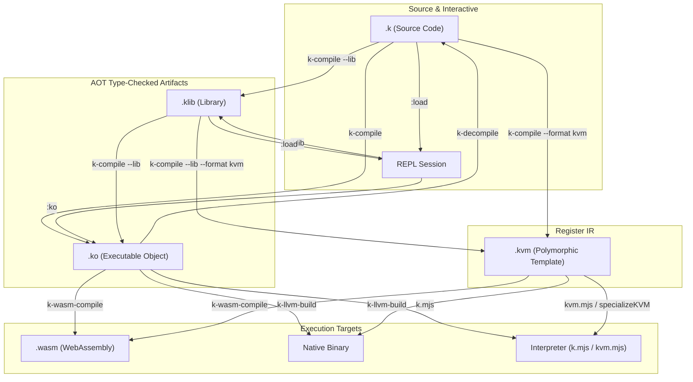

# File Formats in the K Universe

The `k` toolchain operates across four primary file formats: `.k`,
`.ko`, `.klib`, and `.kvm`. Each format occupies a distinct position
in the pipeline from human-authored source to ahead-of-time (AOT)
type-checked artifacts and JIT/native execution.

---

## Overview & Comparison

| Extension  | Role                               | Internal Storage                                | Entrypoint (`main`)            | Generated By                      | Consumed By                                             |
|:----------:|:-----------------------------------|:------------------------------------------------|:-------------------------------|:----------------------------------|:--------------------------------------------------------|
| **`.k`**   | Human-readable source code         | UTF-8 plain text                                | Optional (trailing expression) | Editor, `k-decompile`             | `k.mjs`, `k-repl`, `k-compile`, backends                 |
| **`.ko`**  | Executable compiled object         | Binary (`KOBJ\n` + JSON payload)                | **Required** (`"__main__"`)    | `k-compile`, REPL (`:ko`)         | `k.mjs`, `k-wasm-compile`, `k-llvm-build`, inspect tools  |
| **`.klib`**| Reusable compiled library          | UTF-8 JSON payload                              | **None** (`null`)              | `k-compile --lib`, REPL (`:klib`) | REPL (`:load`), CLI linkers (`--lib`)                    |
| **`.kvm`** | Polymorphic kVM bytecode template  | JSON / CBOR (`format: "k-vm", layer: "KVM-P"`)  | Per-relation functions         | `k-compile --format kvm`, kvm.mjs | `kvm.mjs`, `k-wasm-compile`, `k-llvm-build`              |

### Format Transformation Workflow



---

## 1. `.k` — Source Code File

### What It Is
`.k` files contain the high-level, human-readable source code of the
`k` language. A `.k` file defines:
- **Algebraic Data Types:** Products (`{ field1 label1, field2 label2 }`)
  and tagged unions (`< tag1 arm1, tag2 arm2 >`).
- **Relations:** First-order partial functions composed via sequence,
  union, projection, or product construction.
- **Top-level Expressions:** Computations evaluated when the file is run
  as a script.

### How to Generate
- Written manually in any text editor.
- Decompiled from an existing `.ko` or `.klib` artifact:
  ```bash
  k-decompile program.ko program.decompiled.k
  ```

### How to Consume
- **Run directly over stream input:**
  ```bash
  ./k.mjs program.k
  ```
- **Load into interactive REPL session:**
  ```k
  :load Examples/arithmetics.k
  ```
- **Compile into compiled artifacts:**
  ```bash
  # Compile to executable object (.ko)
  k-compile program.k program.ko

  # Compile to reusable library (.klib)
  k-compile --lib program.k program.klib

  # Compile to polymorphic kVM template (.kvm)
  k-compile --format kvm program.k program.kvm
  ```

---

## 2. `.ko` — Executable Object File

### What It Is
`.ko` is an ahead-of-time (AOT) type-checked, self-contained executable
object artifact (`format: "k-object"`, `kind: "executable"`).

In the `k` toolchain, "ahead-of-time" means that parsing, relation
expansion, structural type derivation, and constraint convergence are
completed beforehand during compilation. The resulting artifact stores
the fully converged principal type graphs and interned type hashes.
- **Physical Layout:** Prefixed by a 5-byte magic header `KOBJ\n`,
  followed by a JSON payload.
- **Payload Contents:**
  - `codes`: Type-code dictionary (interned structural type hashes).
  - `rels`: Compiled relation ASTs and converged principal type graphs.
  - `main`: Fixed entrypoint name (usually `"__main__"`).
  - `meta`: Compiler origins and source position mapping.
- **Key Advantage:** Skips both parsing and type derivation. Running a
  `.ko` executes immediately without cold-start compilation overhead.

### How to Generate

#### From the CLI (`k-compile`):
Compile a source file into an executable object:
```bash
k-compile program.k program.ko
```

Compile an inline expression that links a library (`.klib` or `.k`):
```bash
# Note: Library relation aliases referenced by name in the expression
# must be explicitly mapped into scope via --export:
k-compile --lib Examples/arithmetics.k \
  --export plus \
  --export int \
  --export 5 \
  '{() x, 5 int y} plus' \
  add5.ko
```

#### From the REPL (`:ko`):
Export the current session into an executable object with a custom
entrypoint expression:
```k
:load Examples/arithmetics.k
:ko add5.ko {() x, 5 int y} plus
```

### How to Consume

- **Execute using the standard interpreter (`k.mjs`):**
  ```bash
  echo "10" | ./codecs/int.mjs --parse | \
    ./k.mjs add5.ko | ./codecs/int.mjs --print
  # Output: 15
  ```

- **Compile to a standalone WebAssembly binary (`k-wasm-compile`):**
  ```bash
  k-wasm-compile add5.ko add5.wasm
  echo "10" | ./codecs/int.mjs --parse | \
    node backends/wasm/bin/k-wasm-run.mjs add5.wasm | \
    ./codecs/int.mjs --print
  # Output: 15
  ```

- **Compile to a native machine executable via LLVM (`k-llvm-build`):**
  ```bash
  k-llvm-build add5.ko -o add5
  echo "10" | ./codecs/int.mjs --parse | ./add5 | ./codecs/int.mjs --print
  # Output: 15
  ```

- **Inspect, validate, or decompile:**
  ```bash
  k-inspect-object add5.ko
  k-validate-object add5.ko
  k-decompile add5.ko decompiled.k
  ```

---

## 3. `.klib` — Library Object File

### What It Is
`.klib` is an AOT type-checked library container (`format: "k-object"`,
`kind: "library"`).
- **Physical Layout:** Stored as plain UTF-8 JSON (no `KOBJ\n` header).
- **Payload Contents:**
  - `codes`: Type-code dictionary.
  - `rels`: Compiled and type-converged relations.
  - `main: null`: Unlike `.ko`, there is no single execution entrypoint.
  - `relAlias`: Public alias mapping of exported relations.
  - `typeAliases`: Public alias mapping of exported types.
- **Key Advantage:** Pre-derives types across large relation suites
  (such as `Examples/arithmetics.k` or `poly.k`), allowing downstream
  programs to link them instantaneously without re-running type
  convergence.

### How to Generate

#### From the CLI (`k-compile`):
Compile a source file into a library (the format is automatically
inferred from the `.klib` extension or `--lib`/`--format` flag):
```bash
k-compile Examples/arithmetics.k math.klib
# Or explicitly:
k-compile --lib Examples/arithmetics.k math.klib
```

#### From the REPL (`:klib`):
Export all currently loaded relations and types into a reusable library:
```k
:load Examples/arithmetics.k
:load Examples/poly.k
:klib my_lib.klib
```

### How to Consume

- **Load into an interactive REPL session:**
  ```k
  :load math.klib
  ```

- **Link as a dependency in downstream compilation (`--lib`):**
  ```bash
  k-compile --lib math.klib \
    --export plus \
    --export int \
    --export 5 \
    '{() x, 5 int y} plus' \
    add5.ko
  ```

- **Link into standalone WebAssembly or native LLVM builds:**
  ```bash
  k-wasm-compile --lib math.klib \
    --export plus --export int --export 5 \
    '{() x, 5 int y} plus' add5.wasm

  k-llvm-build --lib math.klib \
    --export plus --export int --export 5 \
    '{() x, 5 int y} plus' -o add5
  ```

- **Inspect contents or extract alias declarations:**
  ```bash
  # View object metadata summary (relation counts, type codes):
  k-inspect-object math.klib

  # Extract active alias definitions as valid k source snippet:
  k-extract-aliases math.klib math-aliases.k

  # Validate structure and KIR-P export:
  k-validate-object math.klib
  ```

---

## 4. `.kvm` — Polymorphic kVM Template File

### What It Is
`.kvm` is a polymorphic register-IR template artifact
(`format: "k-vm"`, `layer: "KVM-P"`, `isPolymorphic: true`).

#### Why `.kvm` Exists (What You Gain):

1. **Relational AST vs. Linear Register Machine:**
   `.ko` and `.klib` store high-level relational combinators (compositions
   `(f g)`, products `{a x, b y}`, unions `<f, g>`) and structural type
   graphs. They contain no virtual registers, instruction sequences, or
   control-flow branches. `.kvm` transforms this functional tree into a
   linear 3-address virtual register machine IR (`alloc`, `project_field`,
   `make_variant`, `project_variant`, `jump_if_fail`, `call`, and loops).

2. **$1 \times N$ Backend Decoupling:**
   Rather than having every code generator (LLVM, WebAssembly, ARM64,
   and the JIT interpreter) independently lower the relational tree and
   re-implement type-guided control flow, relational-to-imperative
   lowering occurs once in `kvm.mjs`. All backends consume the exact same
   ~10 linear kVM instructions (`kvm2llvm.mjs`, `kvm2wasm.mjs`,
   `kvm2arm64.mjs`, `kvm.mjs`).

3. **Microsecond Polymorphic Specialization (`layer: "KVM-P"`):**
   In polymorphic programs, specializing `.ko` requires re-running the
   compiler's full structural type derivation and constraint convergence
   engine. A `.kvm` template stores pre-compiled register bytecode with
   principal pattern graphs. The runtime specializer (`specializeKVM`)
   prunes dead branches and folds redundant guards against concrete
   runtime input envelopes $(v, P_v)$ in microseconds with zero AST
   recompilation overhead.

4. **Inspectable & Cacheable Register IR:**
   `.kvm` produces a human- and machine-readable JSON or CBOR format.
   You can inspect virtual register assignments, verify dead-branch
   elimination, diff compiler output across runs, or cache the lowered IR
   to bypass frontend compilation when building native or WASM targets.

### How to Generate

#### From the CLI (`k-compile`):
Specify the `.kvm` extension or `--format kvm`:
```bash
# Compile directly from an expression linking a library:
k-compile --lib math.klib \
  --export plus --export int --export 5 \
  '{() x, 5 int y} plus' \
  add5.kvm

# Or lower an existing .ko object directly into a .kvm template:
k-compile add5.ko add5.kvm
```

### How to Consume

- **Direct lowering from `.kvm` to Native Binaries (`k-llvm-build`):**
  Compile a `.kvm` template directly into a native executable:
  ```bash
  k-llvm-build add5.kvm add5-bin
  echo "10" | ./codecs/int.mjs --parse | \
    ./add5-bin | \
    ./codecs/int.mjs --print
  # Output: 15
  ```

- **Direct lowering from `.kvm` to LLVM IR (`k-llvm-compile`):**
  Emit LLVM assembly directly from the register IR:
  ```bash
  k-llvm-compile add5.kvm add5.ll
  ```

- **Direct lowering from `.kvm` to WebAssembly (`k-wasm-compile`):**
  Compile a `.kvm` template directly into a standalone `.wasm` module:
  ```bash
  k-wasm-compile add5.kvm add5.wasm
  echo "10" | ./codecs/int.mjs --parse | \
    node backends/wasm/bin/k-wasm-run.mjs add5.wasm | \
    ./codecs/int.mjs --print
  # Output: 15
  ```

- **Programmatic runtime specialization (`specializeKVM`):**
  In JavaScript / Node.js host embeddings:
  ```javascript
  import { specializeKVM, executeKVM } from "./kvm.mjs";

  // Specialize polymorphic template to runtime input envelope (P, v):
  const specialized = specializeKVM(kvmArtifact, inputEnvelope);
  const result = executeKVM(specialized.func, value, context);
  ```

---

## Practical Rules & Common Gotchas

### 1. Library Aliases Require Explicit `--export`
In `k`, relations and types are identified canonically by their
content-addressed hashes (`@hash`). There is no global symbol namespace.

Human-readable identifiers (such as `plus`, `int`, or `5`) are *aliases*
stored in the object metadata (`relAlias`, `typeAliases`). When linking a
library via `--lib math.klib`, all compiled relations are loaded under
their canonical hashes, but their human-readable aliases are not
automatically imported into the consumer's local alias scope.

To use friendly names in an expression, explicitly map them into scope
using `--export`:
```bash
# Correct: imports 'plus', 'int', and '5' aliases into local scope:
k-compile --lib math.klib \
  --export plus --export int --export 5 \
  '{() x, 5 int y} plus' add5.ko

# Optional renaming syntax ('libAlias:localAlias'):
k-compile --lib math.klib \
  --export plus:+ --export int --export 5 \
  '{() x, 5 int y}+' add5.ko
```
You can also reference any library relation directly by its canonical
hash without `--export`.

### 2. No Built-in Numbers (Relations as Values)
In `k`, there are no primitive numerical types or built-in integer
literals. Identifiers such as `5` or `10` are not language keywords;
they are defined relations (aliases) in `Examples/arithmetics.k`:
- `5` and `10` are nullary relations (constants) of type `${} -> $bits`,
  defined as binary digit trees over `$bits = < {} _, bits 0, bits 1 >`.
- Arithmetic operations (`plus`, `minus`, `times`, `inc`) operate on
  signed integers (`$int = < bits "+", bits "-" >`).
- Passing a bit-representation like `5` to an integer relation requires
  applying the `int` constructor (`5 int`), producing a constant
  relation of type `${} -> $int`.

### 3. Constant Expressions vs. Stream Transformers
- **Stream Transformers:** An expression using the identity relation `()`
  (such as `{() x, 5 int y} plus`) depends on external input. It reads
  an enveloped value from `stdin` (here, a signed integer decoded via
  `./codecs/int.mjs --parse`).
- **Closed Constant Relations:** A relation with no free inputs (such
  as `{10 int x, 5 int y} plus`) is a constant relation with input
  type of unit `${}`. When executed through `./k.mjs`, it expects
  an empty unit `{}` on `stdin`:
  ```bash
  echo "{}" | node codecs/k-parse.mjs | \
    ./k.mjs add_constants.ko | ./codecs/int.mjs --print
  ```
