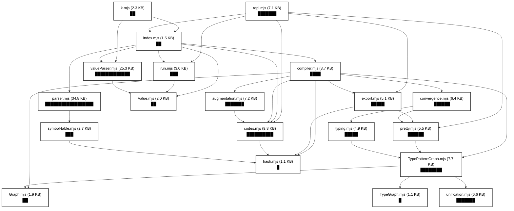

# Project Dependency Graph

```mermaid
graph TD
    %% Base styling (no colors)
    classDef default fill:#fff,stroke:#333,stroke-width:2px,color:#000;

    %% High-level API & Execution
    k["k.mjs (2.3 KB)<br/>██"] --> index["index.mjs (1.5 KB)<br/>██"]
    k --> valueParser["valueParser.mjs (25.3 KB)<br/>█████████████"]
    
    repl["repl.mjs (7.1 KB)<br/>███████"] --> index
    repl --> run["run.mjs (3.0 KB)<br/>███"]
    repl --> pretty["pretty.mjs (5.5 KB)<br/>██████"]
    repl --> codes["codes.mjs (9.8 KB)<br/>██████████"]
    repl --> export["export.mjs (5.1 KB)<br/>█████"]
    
    index --> parser["parser.mjs (34.8 KB)<br/>██████████████████"]
    index --> Value["Value.mjs (2.0 KB)<br/>██"]
    index --> valueParser
    index --> compiler["compiler.mjs (3.7 KB)<br/>████"]
    index --> run
    index --> codes

    %% Execution Semantics
    run --> Value

    %% Type Derivation & Compiler
    compiler --> TypePatternGraph["TypePatternGraph.mjs (7.7 KB)<br/>████████"]
    compiler --> codes
    compiler --> Graph["Graph.mjs (1.9 KB)<br/>██"]
    compiler --> hash["hash.mjs (1.1 KB)<br/>█"]
    compiler --> export
    compiler --> augmentation["augmentation.mjs (7.2 KB)<br/>███████"]
    compiler --> convergence["convergence.mjs (6.4 KB)<br/>██████"]
    
    export --> pretty
    export --> hash
    
    augmentation --> codes
    
    convergence --> pretty
    convergence --> typing["typing.mjs (4.9 KB)<br/>█████"]

    pretty --> TypePatternGraph
    
    %% Core Registries & Types
    codes --> hash
    TypePatternGraph --> Graph
    TypePatternGraph --> TypeGraph["TypeGraph.mjs (1.1 KB)<br/>█"]
    TypePatternGraph --> unification["unification.mjs (6.6 KB)<br/>███████"]
    
    typing --> TypePatternGraph

    %% Parsers (Jison dependencies)
    parser --> symbolTable["symbol-table.mjs (2.7 KB)<br/>███"]
    symbolTable --> hash
    
    valueParser --> Value
```
